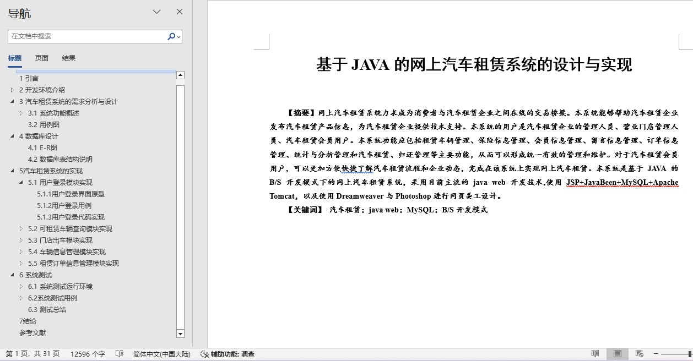
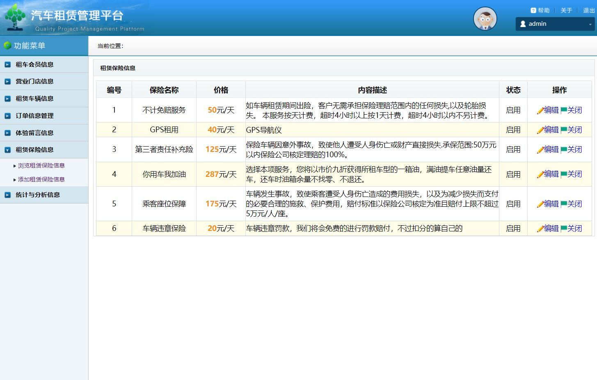
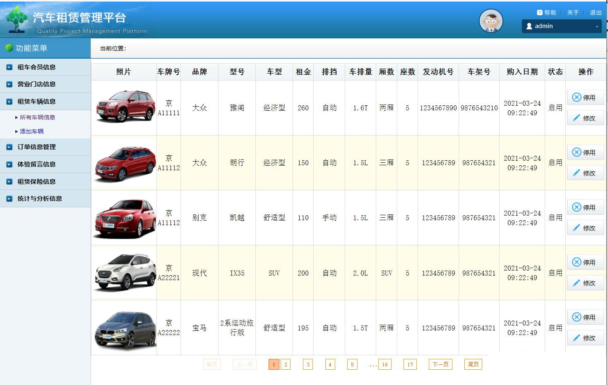
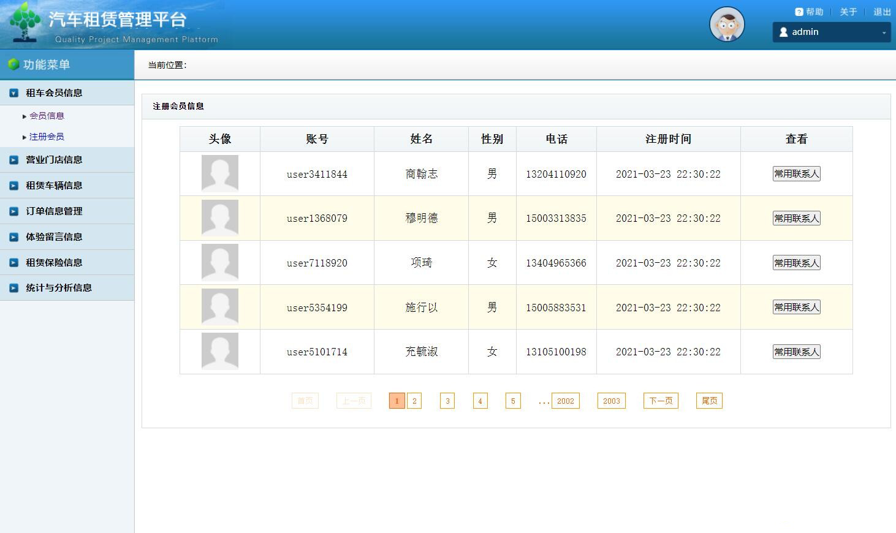

## 基于JSP+Servlet实现的汽车租赁系统(程序+报告)

- <b>完整代码获取地址：从戎源码网 ([https://armycodes.com/](https://armycodes.com/))</b>
- <b>技术探讨、资料分享，请加QQ群：692619798</b> 
- <b>作者微信：19941326836  QQ：952045282</b> 
- <b>承接计算机毕业设计、Java毕业设计、Python毕业设计、深度学习、机器学习</b>
- <b>选题+开题报告+任务书+程序定制+安装调试+论文+答辩ppt 一条龙服务</b>
- <b>所有选题地址 ([https://github.com/YuLin-Coder/AllProjectCatalog](https://github.com/YuLin-Coder/AllProjectCatalog)) </b>

## 项目介绍
基于JSP+Servlet实现的汽车租赁系统，主要功能如下

【管理员】

租车会员信息：会员信息，注册会员

营业门店信息：门店信息，添加门店

租赁车辆信息：所有车辆信息，添加车辆

订单信息管理：全部订单，待支付订单，待出车订单，租赁中订单，待还车订单，已完成订单，已取消订单

体验留言信息：全部留言信息

租赁保险信息：浏览租赁保险信息，添加租赁保险信息

统计与分析信息：企业营业情况统计，用户发展情况统计，车辆出租情况统计

【用户】

1. 用户注册和登录：用户可以注册新账户，然后使用注册的账户进行登录。

2. 车辆查询和展示：用户可以浏览系统中的车辆信息，包括车辆型号、品牌、价格等。

3. 车辆租赁：用户可以选择租赁一辆车辆，选择租赁的时间和退还时间，并确认订单。

4. 订单管理：用户可以查看自己的订单列表，包括已完成和未完成的订单。

5. 支付功能：用户在确认订单后可以选择支付租车费用。

6.可选择营业门店，用户体验，网站介绍
个人信息管理：会员信息，修改密码
常用联系人管理：常用联系人
我的订单：全部订单
我的留言：全部留言

【门店】

营业门店管理:门店信息,修改密码

门店车辆管理:门店车辆信息,添加门店车辆

门店车辆管理:门店车辆信息,添加门店车辆

租赁订单管理:全部订单,待支付订单,待出车订单,租赁中订单,待还车订单,已完成订单,已取消订单

统计与分析信息,企业营业情况统计

## 项目技术
- 编程语言：Java
- 数据库：MySQL
- 前端技术：JSP、JavaScript、bootstrap、JQuery
- 后端技术：Servlet、JDBC

## 运行环境
- JDK版本：JDK1.8及以上
- 开发工具：IDEA、Ecplise、Myecplise都可以
- 数据库: MySQL5.7及以上

## 运行截图

